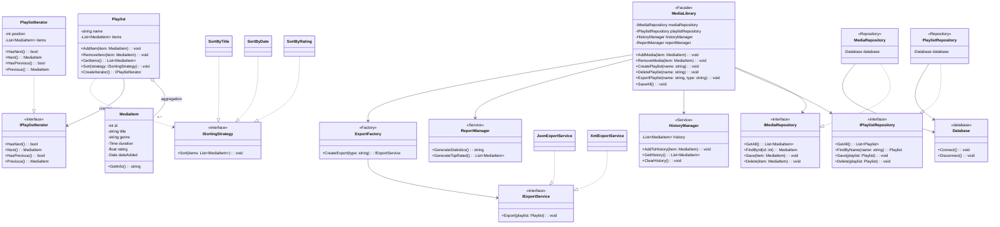

# UML Diagram – Media Libraries
## Class Diagram

```mermaid
classDiagram

%% =====================================================
%% DOMAIN LAYER
%% =====================================================

class MediaItem {
    -int id
    -string title
    -string genre
    -Time duration
    -float rating
    -Date dateAdded
    +GetInfo() : string
}

class Playlist {
    -string name
    -List~MediaItem~ items
    +AddItem(item: MediaItem) : void
    +RemoveItem(item: MediaItem) : void
    +GetItems() : List~MediaItem~
    +Sort(strategy: ISortingStrategy) : void
    +CreateIterator() : IPlaylistIterator
}

%% =====================================================
%% ITERATOR PATTERN
%% =====================================================

class IPlaylistIterator {
    <<interface>>
    +HasNext() : bool
    +Next() : MediaItem
    +HasPrevious() : bool
    +Previous() : MediaItem
}

class PlaylistIterator {
    -int position
    -List~MediaItem~ items
    +HasNext() : bool
    +Next() : MediaItem
    +HasPrevious() : bool
    +Previous() : MediaItem
}

%% =====================================================
%% STRATEGY PATTERN
%% =====================================================

class ISortingStrategy {
    <<interface>>
    +Sort(items: List~MediaItem~) : void
}

class SortByRating
class SortByDate
class SortByTitle

%% =====================================================
%% REPOSITORY / DAO PATTERN
%% =====================================================

class IMediaRepository {
    <<interface>>
    +GetAll() : List~MediaItem~
    +FindById(id: int) : MediaItem
    +Save(item: MediaItem) : void
    +Delete(item: MediaItem) : void
}

class MediaRepository {
    <<Repository>>
    -Database database
}

class IPlaylistRepository {
    <<interface>>
    +GetAll() : List~Playlist~
    +FindByName(name: string) : Playlist
    +Save(playlist: Playlist) : void
    +Delete(playlist: Playlist) : void
}

class PlaylistRepository {
    <<Repository>>
    -Database database
}

%% =====================================================
%% FACTORY METHOD PATTERN
%% =====================================================

class IExportService {
    <<interface>>
    +Export(playlist: Playlist) : void
}

class JsonExportService
class XmlExportService

class ExportFactory {
    <<Factory>>
    +CreateExport(type: string) : IExportService
}

%% =====================================================
%% SERVICE LAYER
%% =====================================================

class HistoryManager {
    <<Service>>
    -List~MediaItem~ history
    +AddToHistory(item: MediaItem) : void
    +GetHistory() : List~MediaItem~
    +ClearHistory() : void
}

class ReportManager {
    <<Service>>
    +GenerateStatistics() : string
    +GenerateTopRated() : List~MediaItem~
}

class MediaLibrary {
    <<Facade>>
    -IMediaRepository mediaRepository
    -IPlaylistRepository playlistRepository
    -HistoryManager historyManager
    -ReportManager reportManager
    +AddMedia(item: MediaItem) : void
    +RemoveMedia(item: MediaItem) : void
    +CreatePlaylist(name: string) : void
    +DeletePlaylist(name: string) : void
    +ExportPlaylist(name: string, type: string) : void
    +SaveAll() : void
}

%% =====================================================
%% DATABASE
%% =====================================================

class Database {
    <<database>>
    +Connect() : void
    +Disconnect() : void
}

%% =====================================================
%% RELATIONSHIPS
%% =====================================================

Playlist o-- "0..*" MediaItem : aggregation

Playlist --> IPlaylistIterator : creates
PlaylistIterator ..|> IPlaylistIterator

Playlist ..> ISortingStrategy : uses
SortByRating ..|> ISortingStrategy
SortByDate ..|> ISortingStrategy
SortByTitle ..|> ISortingStrategy

MediaRepository ..|> IMediaRepository
PlaylistRepository ..|> IPlaylistRepository

MediaLibrary --> IMediaRepository
MediaLibrary --> IPlaylistRepository
MediaLibrary --> HistoryManager
MediaLibrary --> ReportManager

MediaLibrary --> ExportFactory
ExportFactory --> IExportService
JsonExportService ..|> IExportService
XmlExportService ..|> IExportService

MediaRepository --> Database
PlaylistRepository --> Database
```
